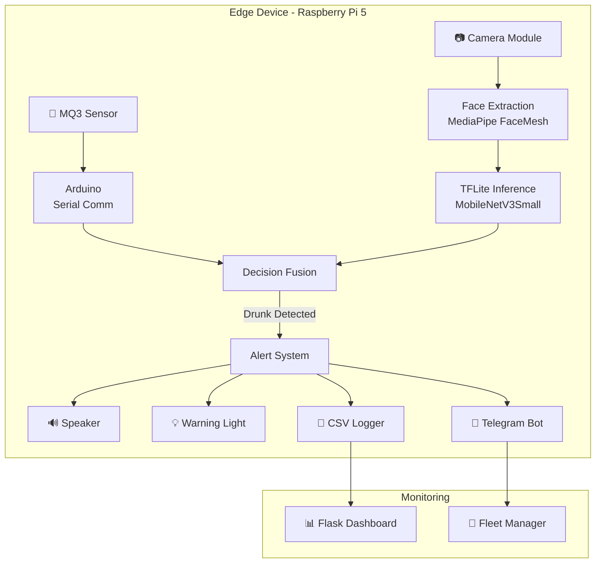
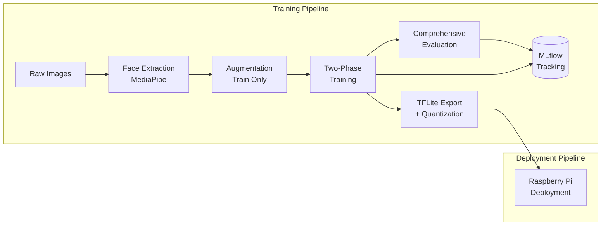
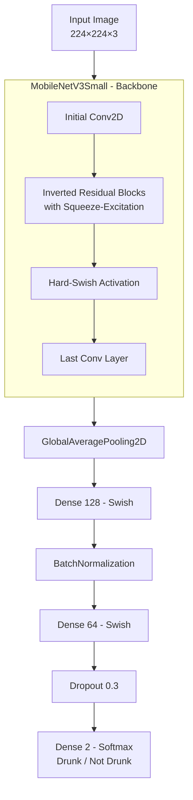
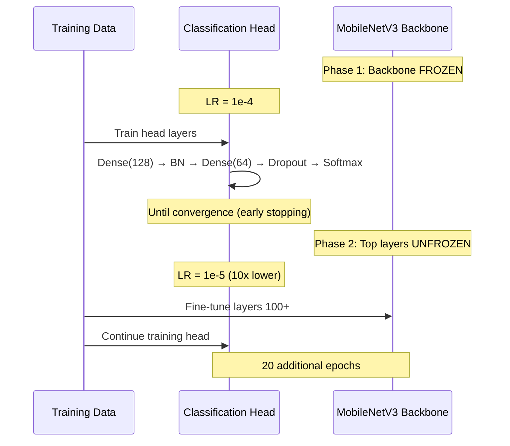
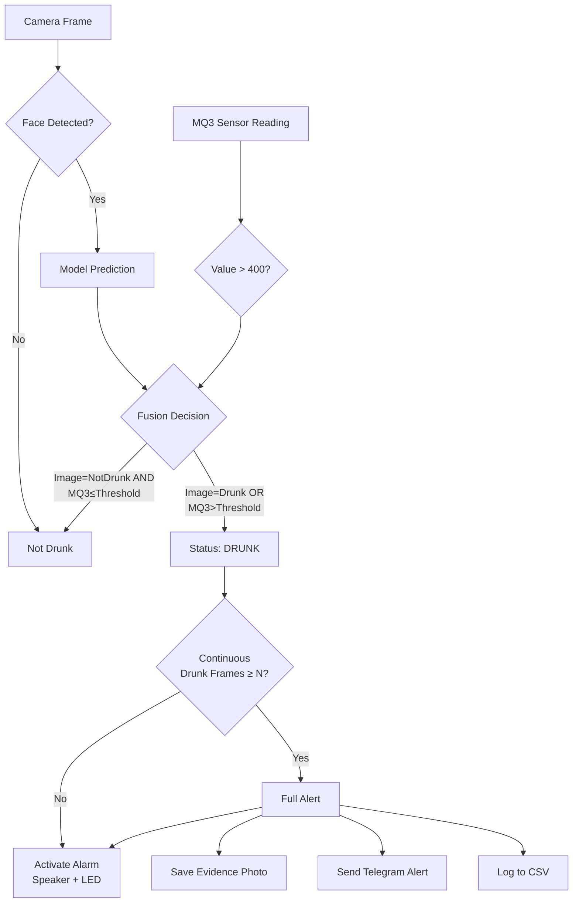

# Architecture Documentation — Drunk Detection System

## System Overview

The Drunk Detection System is an end-to-end AI solution for real-time intoxication detection, deployed on edge hardware (Raspberry Pi 5). It combines computer vision (facial analysis) with IoT sensor data (MQ3 alcohol sensor) for multi-modal decision fusion.

## System Architecture



## Data Flow Pipeline



## Model Architecture



## Two-Phase Training Strategy



## Decision Fusion Logic



## Project Structure

```
Drunk_Detection_System/
├── configs/
│   └── default.yaml              # Centralized configuration
├── src/                           # Core ML package
│   ├── data/
│   │   ├── face_extraction.py    # MediaPipe face extraction
│   │   ├── preprocessing.py      # Image preprocessing
│   │   ├── dataset.py            # Data generators (augmentation fix)
│   │   └── augmentation.py       # Augmentation configs
│   ├── models/
│   │   ├── mobilenet_v3.py       # Model architecture
│   │   └── export.py             # TFLite/ONNX export
│   ├── training/
│   │   ├── trainer.py            # Two-phase training orchestrator
│   │   └── callbacks.py          # Training callbacks
│   ├── evaluation/
│   │   └── evaluator.py          # Comprehensive eval + Grad-CAM
│   └── utils/
│       ├── logger.py             # Structured logging
│       └── config.py             # YAML + env config loader
├── scripts/                       # CLI entry points
│   ├── train.py                  # Training pipeline
│   ├── evaluate.py               # Evaluation pipeline
│   └── export_tflite.py          # Model export
├── deployment/
│   ├── raspi/                    # Raspberry Pi deployment
│   │   ├── main.py               # Main loop + health check + benchmark
│   │   ├── config.py             # Env-based config (no hardcoded secrets)
│   │   └── modules/
│   │       ├── camera.py         # Camera with fallback
│   │       ├── image_processing.py # Edge inference engine
│   │       ├── mq3_sensor.py     # MQ3 sensor interface
│   │       ├── telegram_bot.py   # Async notifications
│   │       └── logger.py         # CSV warning logger
│   └── dashboard/
│       ├── app.py                # Flask monitoring dashboard
│       └── templates/
│           └── index.html        # Dashboard UI
├── docs/
│   ├── ARCHITECTURE.md           # This file
│   └── MODEL_CARD.md             # Model documentation
├── .env.example                   # Environment variable template
├── .gitignore                     # Git ignore rules
├── requirements.txt               # Python dependencies
├── setup.py                       # Package installation
└── README.md                      # Project overview
```

## Technology Stack

| Layer | Technology | Purpose |
|-------|-----------|---------|
| **ML Framework** | TensorFlow/Keras | Model training & evaluation |
| **Backbone** | MobileNetV3Small | Feature extraction (transfer learning) |
| **Face Detection** | MediaPipe FaceMesh | Face region extraction |
| **Edge Runtime** | TFLite | Optimized inference on Raspberry Pi |
| **Experiment Tracking** | MLflow | Hyperparameter & metric logging |
| **Sensor Interface** | PySerial | MQ3 sensor via Arduino |
| **Notifications** | python-telegram-bot | Real-time alerts |
| **Dashboard** | Flask + Bootstrap 5 | Monitoring UI |
| **Config** | YAML + python-dotenv | Centralized configuration |
| **Logging** | Python logging | Structured log output |

## Key Design Decisions

### 1. Why MobileNetV3 over other architectures?
MobileNetV3Small was chosen for its optimal balance of accuracy and efficiency on edge devices. With ~2.5M parameters (vs ResNet50's 25M), it runs at 10-15 FPS on Raspberry Pi while maintaining competitive accuracy.

### 2. Why two-phase training?
Phase 1 (frozen backbone) prevents catastrophic forgetting of ImageNet features while training the classification head. Phase 2 (fine-tuning) adapts upper backbone features to the drunk detection domain with a lower learning rate.

### 3. Why sensor fusion?
Camera-only detection has limitations (lighting, occlusion). The MQ3 alcohol sensor provides a complementary signal. The OR-based fusion strategy prioritizes safety (detecting all drunk cases) over specificity.

### 4. Why edge deployment?
- **Privacy**: Face images stay on-device
- **Latency**: No network round-trip for real-time response
- **Reliability**: Works without internet connectivity
- **Cost**: No cloud inference costs
